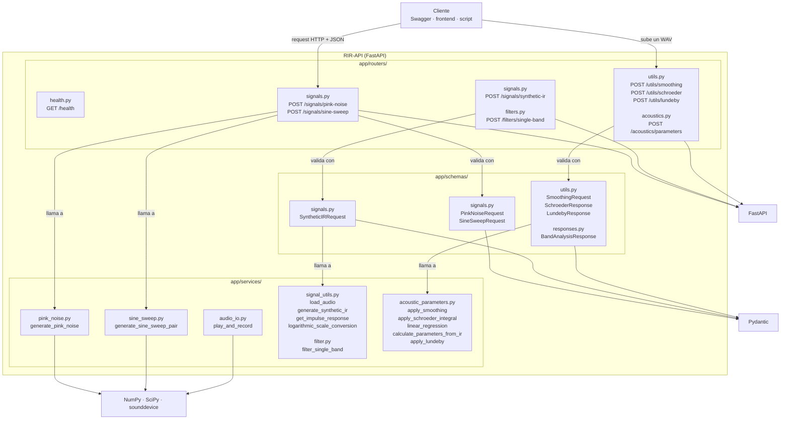

# RIR-API

API REST para procesamiento y analisis de respuestas al impulso segun la norma ISO 3382.


## Descripcion

RIR-API es el trabajo practico de Senales y Sistemas (UNTREF, 2C 2026): una API REST
(FastAPI) con la cadena completa de procesamiento acustico, desde la generacion de senales
de excitacion hasta el calculo de parametros acusticos (EDT, T20, T30, D50, C80) segun
ISO 3382-1.

- Consigna, especificaciones y ruta del TP: <https://maxiyommi.github.io/signal-systems/trabajo_practico/ruta/>
- API de referencia de la catedra (Swagger UI): <https://rir-api.onrender.com/docs>

## Integrantes

Valentina De Piero | Legajo 72221 | Responsable de generación de señales

## Requisitos previos

- Python 3.12 o superior
- [uv](https://docs.astral.sh/uv/) (gestor de paquetes y entornos virtuales)
- git y una cuenta de GitHub

## Instalacion y ejecucion

```bash
# Crear el entorno e instalar dependencias (incluye las de desarrollo: pytest, ruff, ...)
uv sync

# Iniciar la API con hot-reload
uv run uvicorn app.main:app --reload

# Correr los tests
uv run pytest
```

La API queda disponible en `http://localhost:8000`. Documentacion interactiva:

- Swagger UI: `http://localhost:8000/docs`
- ReDoc: `http://localhost:8000/redoc`

## Branching strategy
La idea es mantener la rama "main" protegida y sólo realizar commits a la misma cuando esté comprobada la funcionalidad y compatibilidad de los mergeos correspondentes. Sólo se realizarían cambios a main desde la rama "dev" como etapa previa. Luego, se crearán ramas por integrante que realicen commits a dev para unificarlas.


## Diagrama de estructura


## Estructura del proyecto

```
rir-api/
├── app/
│   ├── __init__.py
│   ├── main.py                    # Punto de entrada FastAPI (/ y /health)
│   ├── settings.py                # Configuracion (pydantic-settings, variables RIR_*)
│   ├── routers/
│   │   ├── __init__.py
│   │   ├── health.py              # GET /health (M0)
│   │   └── audio_http.py          # wav_response y uploaded_file (ya resueltas)
│   ├── schemas/
│   │   └── __init__.py            # Modelos Pydantic de request/response (desde M1)
│   └── services/
│       ├── __init__.py
│       ├── pink_noise.py          # generate_pink_noise (M1)
│       ├── sine_sweep.py          # generate_sine_sweep_pair (M1)
│       ├── audio_io.py            # play_and_record (M1)
│       ├── signal_utils.py        # load_audio, generate_synthetic_ir, get_impulse_response,
│       │                          # logarithmic_scale_conversion (M2)
│       ├── filter.py              # filter_single_band (M2)
│       └── acoustic_parameters.py # apply_smoothing, apply_schroeder_integral, linear_regression,
│                                  # calculate_parameters_from_ir, apply_lundeby (M3)
├── tests/
│   ├── data/                      # WAV chicos de prueba (se versionan)
│   ├── test_placeholder.py        # Test trivial (M0)
│   ├── test_generacion.py         # Tests de M1
│   ├── test_procesamiento.py      # Tests de M2
│   ├── test_analisis.py           # Tests de M3 (services)
│   └── test_api.py                # Tests de endpoints, por milestone (M0 a M3)
├── data/                          # Mediciones y audios locales (ignorado por git)
├── docs/
│   └── README.md                  # Guia para la documentacion (graficas de validacion, etc.)
├── .github/workflows/ci.yml       # CI: ruff + pytest en cada push/PR
├── .gitignore
├── pyproject.toml                 # Dependencias y configuracion (ruff, pytest)
└── README.md
```

## Referencias

- ISO 3382-1:2009 — Acoustics — Measurement of room acoustic parameters.
- Farina, A. (2000). *Simultaneous measurement of impulse response and distortion with a
  swept-sine technique.* 108th AES Convention.
- Schroeder, M. R. (1965). *New method of measuring reverberation time.* JASA 37(3).
- [FastAPI](https://fastapi.tiangolo.com/) · [Pydantic](https://docs.pydantic.dev/) ·
  [uv](https://docs.astral.sh/uv/)
